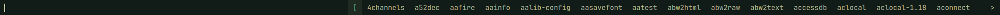
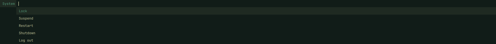

# Dynamic Menu for Omarchy

[suckless dmenu](https://tools.suckless.org/dmenu/), rebuilt as an
[Omarchy](https://omarchy.org) shell plugin. It draws a one-line bar across the
top of the screen. Lines piped in on stdin become the items, and your pick is
printed to stdout. It runs inside `omarchy-shell` and follows your Omarchy theme.
Plugin ID: `jesusarchive.dynamic-menu`. MIT licensed.



```bash
printf 'yes\nno\n' | dmenu -p 'Reboot?'
```

- **Same behaviour as dmenu 5.4.** The input handling, matching, paging and
  layout are ported from `dmenu.c`. That covers every key from the dmenu man
  page, the `<` `>` page markers, `-l` vertical lists, and Ctrl+Return to pick
  several items.
- **Same flags.** Existing dmenu scripts work unchanged.
- **Comes with `dmenu_run` and `dmenu_path`.** Bind `dmenu_run` to a key to
  pick a program from your `$PATH` and run it.
- **Themed.** It uses the Omarchy menu colors and font and follows
  `omarchy theme set`. Its rows are as tall as the Omarchy bar, so the menu sits
  exactly over it. Pass flags to get dmenu's own colors instead.

## Install

```bash
omarchy plugin add https://github.com/jesusarchive/omarchy-dynamic-menu.git --enable
```

Manual install from a checkout:

```bash
omarchy plugin validate .
mkdir -p ~/.config/omarchy/plugins/jesusarchive.dynamic-menu
rsync -a --delete --exclude .git ./ ~/.config/omarchy/plugins/jesusarchive.dynamic-menu/
omarchy plugin enable jesusarchive.dynamic-menu
```

Requirements: `bash`, `jq` and `wl-paste` (wl-clipboard). All three ship with
Omarchy.

### Keybinding

Omarchy plugins don't bind keys themselves, so add the binding to
`~/.config/hypr/bindings.lua`. The suggested key is Super+D, which is free in a
stock Omarchy setup:

```lua
o.bind("SUPER + D", "Dynamic menu", "~/.config/omarchy/plugins/jesusarchive.dynamic-menu/bin/dmenu_run")
```

Hyprland reloads the file on save, and the binding shows up in Omarchy's
keybindings list (Super+K) as "Dynamic menu".

#### Changing the key

1. Pick a free chord. List what's already bound with Super+K, or:

   ```bash
   omarchy menu keybindings --print
   ```

2. Change the first argument of the `o.bind` line, for example to
   `"SUPER + ALT + D"`. Modifiers are `SUPER`, `SHIFT`, `CTRL` and `ALT`, joined
   with ` + `.
3. To use a chord that Omarchy or another plugin already binds, unbind it first,
   on the line before yours:

   ```lua
   hl.unbind("SUPER + SPACE")
   o.bind("SUPER + SPACE", "Dynamic menu", "~/.config/omarchy/plugins/jesusarchive.dynamic-menu/bin/dmenu_run")
   ```

4. Save, then check for mistakes with `hyprctl configerrors`.

The command can take dmenu flags too, for example
`".../bin/dmenu_run -i -p run"` for case-insensitive matching with a prompt.

### Scripts that call `dmenu` by name

Tools and scripts written for dmenu run `dmenu` from your `$PATH`. The plugin
lives in `~/.config/omarchy/plugins/`, which isn't on it, so link the commands
into `~/.local/bin` once:

```bash
~/.config/omarchy/plugins/jesusarchive.dynamic-menu/bin/link-commands
```

It links `dmenu`, `dmenu_run` and `dmenu_path`, and leaves alone any existing
file of the same name that isn't one of its links. Skip this if you only use the
keybinding.

### Remove

```bash
~/.config/omarchy/plugins/jesusarchive.dynamic-menu/bin/link-commands --remove
omarchy plugin remove jesusarchive.dynamic-menu
```

Then delete your keybinding from `bindings.lua`.

## Use

```bash
dmenu [-bfiv] [-l lines] [-p prompt] [-fn font] [-m monitor]
      [-nb color] [-nf color] [-sb color] [-sf color] [-w windowid]
```

| Flag | Meaning |
|---|---|
| `-b` | Show the menu at the bottom of the screen |
| `-i` | Match items case-insensitively |
| `-l lines` | Show items in a vertical list with this many lines |
| `-m monitor` | Show the menu on this monitor, counting from 0. By default it opens on the focused monitor |
| `-p prompt` | Prompt shown to the left of the input |
| `-fn font` | Font, as a fontconfig pattern such as `monospace:size=10` |
| `-nb` `-nf` | Normal background and foreground color |
| `-sb` `-sf` | Selected background and foreground color |
| `-v` | Print the version and exit |
| `-f`, `-w windowid` | Accepted for compatibility. They are X11 features and do nothing here |

Exit status is 0 when something was printed with Return, and 1 when the menu was
closed with Escape.



### Matching

Each space-separated word you type has to appear in the item. Items equal to
the whole input come first, then items starting with the first word, then the
rest, each group in stdin order.

`dmenu_run` lists the programs on your `$PATH` and runs the one you pick in
`$SHELL`. See [Keybinding](#keybinding) to put it on a key.

### Keys

| Key | Action |
|---|---|
| `Return` | Print the selected item and exit. With no match, print the typed text |
| `Shift+Return` | Print the typed text and exit |
| `Ctrl+Return` | Print the selected item and keep the menu open. The item is marked |
| `Escape` | Exit without printing |
| `Tab` | Copy the selected item into the input |
| `Left` / `Right` | Move the text cursor, or the selection once the cursor is at the edge of the text |
| `Up` / `Down` | Previous / next item |
| `Home` / `End` | First / last item, or the start / end of the text |
| `Page Up` / `Page Down` | Previous / next page |
| `Ctrl+Left` / `Ctrl+Right` | Start / end of the current word |
| `Backspace` / `Delete` | Delete the character before / after the cursor |

Emacs-style keys, as in dmenu:

| Key | Action | Key | Action |
|---|---|---|---|
| `Ctrl+A` | Home | `Ctrl+K` | Delete to the end of the line |
| `Ctrl+B` | Left | `Ctrl+U` | Delete to the start of the line |
| `Ctrl+C` | Escape | `Ctrl+W` | Delete the word before the cursor |
| `Ctrl+D` | Delete | `Ctrl+Y` | Paste the primary selection |
| `Ctrl+E` | End | `Ctrl+Shift+Y` | Paste the clipboard |
| `Ctrl+F` | Right | `Alt+B` / `Alt+F` | Start / end of the word |
| `Ctrl+G` | Escape | `Alt+G` / `Alt+Shift+G` | Home / End |
| `Ctrl+H` | Backspace | `Alt+H` / `Alt+L` | Up / Down |
| `Ctrl+I` | Tab | `Alt+J` / `Alt+K` | Page Down / Page Up |
| `Ctrl+J`, `Ctrl+M` | Return | `Ctrl+N` / `Ctrl+P` | Down / Up |
| `Ctrl+Shift+J`, `Ctrl+Shift+M` | Shift+Return | `Ctrl+[` | Escape |

## Colors

Colors and font come from the current Omarchy theme and follow
`omarchy theme set`. Items picked with Ctrl+Return use the theme accent. There
is nothing to configure.

`-fn`, `-nb`, `-nf`, `-sb` and `-sf` override the theme, the same way they
override `config.def.h` in dmenu.

### Stock dmenu colors

To get dmenu's own look, pass its `config.def.h` defaults:

```bash
dmenu -fn monospace:size=10 -nb '#222222' -nf '#bbbbbb' -sb '#005577' -sf '#eeeeee'
```

That is exactly what dwm passes, so a dwm keybinding works here unchanged:

```bash
dmenu_run -m 0 -fn monospace:size=10 -nb '#222222' -nf '#bbbbbb' -sb '#005577' -sf '#eeeeee'
```

For a permanent stock-looking launcher, put those flags in your keybinding:

```lua
o.bind("SUPER + D", "Dynamic menu",
  "~/.config/omarchy/plugins/jesusarchive.dynamic-menu/bin/dmenu_run -fn monospace:size=10 -nb '#222222' -nf '#bbbbbb' -sb '#005577' -sf '#eeeeee'")
```

Colors set this way are fixed, so changing theme leaves them alone. Leave them
out to follow the theme instead.

Rows are always as tall as the Omarchy bar when the bar is horizontal. dmenu
uses font height plus 2px because that was dwm's bar height. Omarchy's bar has
its own height, so the menu matches that instead.

## How it works

`bin/dmenu` parses the flags the way `main()` in `dmenu.c` does. It streams
stdin into a temporary file and summons the plugin with
`omarchy-shell shell summon jesusarchive.dynamic-menu '<json>'`, passing only
the file's path. Like dmenu reading its own stdin, there is no limit on how much
you pipe in.

The menu appends each printed line to a temporary file and writes the exit
status to a second one when it closes. `bin/dmenu` passes the lines on as they
arrive, so Ctrl+Return picks reach the caller straight away, the same as dmenu
writing to stdout.

`Engine.js` holds dmenu's `keypress()`, `calcoffsets()` and `drawmenu()`, ported
function by function and kept free of Qt so node can test it. `Match.js` is
dmenu's `match()`. `DynamicMenu.qml` draws the result on a layer-shell surface
that takes the keyboard while it is open.

`bin/dmenu_path` lists the executables on `$PATH`, cached in
`~/.cache/dmenu_run`, using the same rules as dmenu's `stest -flx`.
`bin/dmenu_run` pipes that list into `dmenu` and runs the pick in `$SHELL`.

### Differences from dmenu

- Long items are cut off with `…`, not `...`.
- `-m` counts monitors in the order Quickshell lists them.
- A second `dmenu` started while one is open replaces it. In dmenu, the second
  one fails to grab the keyboard.

## Development

```bash
node --test tests/                        # engine and matching tests
omarchy plugin validate .                 # manifest check
rsync -a --delete --exclude .git ./ ~/.config/omarchy/plugins/jesusarchive.dynamic-menu/
omarchy restart shell                     # QML changes need a restart to show up
printf 'foo\nbar\nfoobar\n' | bin/dmenu -p Pick; echo "exit=$?"
```

### Files

- `manifest.json`
- `DynamicMenu.qml`: the bar
- `Engine.js`, `Match.js`: dmenu's logic
- `bin/dmenu`, `bin/dmenu_run`, `bin/dmenu_path`
- `bin/link-commands`: optional links into `~/.local/bin`
- `tests/`

## License

MIT. The input handling, matching and scripts are ported from dmenu 5.4, whose
MIT/X Consortium license and copyright notices are included in `LICENSE`.
