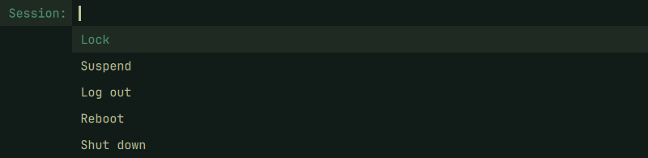
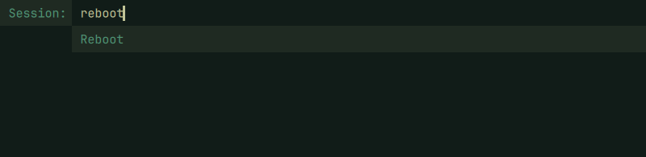

# Dynamic Menu for Omarchy

A [dmenu](https://tools.suckless.org/dmenu/) port for the Omarchy shell.

It reads a list from standard input and writes your selection to standard output.


## Requirements

- Omarchy Quattro with shell plugin support and the Omarchy shell running.
- Quickshell. Tested with version 0.3.1.
- Bash for the command wrappers.
- Python 3.9 or newer for communication with the shell.
- `jq` for reading configuration and building menu options.
- `wl-clipboard` for pasting clipboard text into the menu.

Omarchy includes these dependencies.

## Installation

```bash
omarchy plugin add https://github.com/jesusarchive/omarchy-dynamic-menu.git --enable
```

Add an unused keybinding to `~/.config/hypr/bindings.lua`:

```lua
o.bind("SUPER + D", "Dynamic menu", "~/.config/omarchy/plugins/jesusarchive.dynamic-menu/bin/dmenu_run")
```

`dmenu_run` lists commands from your `$PATH`. It runs your selection or typed command through `$SHELL`, falling back to `/bin/sh`.

## Usage

The keybinding above works without any extra setup.

If you want to run `dmenu`, `dmenu_run`, or `dmenu_path` by name in a terminal or script, create links in `~/.local/bin`:

```bash
~/.config/omarchy/plugins/jesusarchive.dynamic-menu/bin/link-commands
```

This step is optional and requires `~/.local/bin` on your `$PATH`. With the links in place, you can pass a list to `dmenu`:

```bash
printf 'Lock\nSuspend\nLog out\n' | dmenu -p 'Session:'
```

Press Enter to select or Escape to cancel. If nothing matches, Enter submits your typed text. Shift+Enter submits typed text even when an item matches. Ctrl+Enter outputs the selection and keeps the menu open. Use `-i` for case-insensitive matching and `-l 10` for a vertical list.

Only one menu can be active at a time. Menus accept up to 20,000 items of UTF-8 text and 2 MiB of input, with at most 8 KiB per item. At most 50 items appear at once, with fewer on smaller screens. Search supports up to 64 distinct words. Total output is limited to 2 MiB per menu.

## Examples

Create your own menu by passing a list of choices to `dmenu` and handling the selection in your script.

### Session menu

This session menu lets you lock, suspend, log out, reboot, or shut down.



Save the following script as `~/session-menu.sh`. It uses the plugin's full path, so the optional command links are not needed.

```bash
#!/bin/bash

dmenu="$HOME/.config/omarchy/plugins/jesusarchive.dynamic-menu/bin/dmenu"
choice=$(printf '%s\n' 'Lock' 'Suspend' 'Log out' 'Reboot' 'Shut down' |
  "$dmenu" -i -p 'Session:' -l 5) || exit

case "$choice" in
  Lock)        omarchy system lock ;;
  Suspend)     systemctl suspend ;;
  'Log out')   omarchy system logout ;;
  Reboot)      omarchy system reboot ;;
  'Shut down') omarchy system shutdown ;;
esac
```

Run it from a terminal:

```bash
bash ~/session-menu.sh
```

Type to filter, press Enter to run the selected action, or Escape to cancel. For example, typing `reboot` shows:



To add your own action, add its label to `printf` and its command to the `case` block.

## Updating

Update the installed plugin from a terminal:

```bash
omarchy plugin update jesusarchive.dynamic-menu
```

## Removal

Remove the optional command links if you created them:

```bash
~/.config/omarchy/plugins/jesusarchive.dynamic-menu/bin/link-commands --remove
```

Remove the plugin:

```bash
omarchy plugin remove jesusarchive.dynamic-menu
```

Remove the keybinding from `~/.config/hypr/bindings.lua`.

## License and attribution

This plugin uses the [MIT license](LICENSE). The original [dmenu](https://tools.suckless.org/dmenu/) is a [suckless](https://suckless.org/) project. See [the third-party notices](THIRD_PARTY_NOTICES.md) for dmenu and the bundled js-sha256 library.
